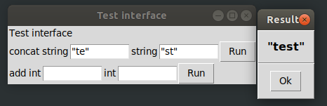
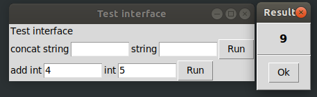

# rpc_tk
[](https://travis-ci.org/gaborigloi/rpc_tk)

From this interface definition:

```ocaml
module Interface(R: Idl.RPC) = struct
  open R

  let str = Idl.Param.mk Rpc.Types.string
  let int_p = Idl.Param.mk Rpc.Types.int

  let concat =
    declare
      "concat"
      ["Concatenates the inputs"]
      (str @-> str @-> returning str Idl.DefaultError.err)

  let add =
    declare
      "add"
      ["Adds two numbers"]
      (int_p @-> int_p @-> returning int_p Idl.DefaultError.err)

  let description = Idl.Interface.{
      name = "Test interface";
      namespace = None;
      description =
        [ "Test interface that has a function "
        ; "for concatenating the inputs "
        ; "and another for adding numbers" ];
      version=(1,0,0)
    }

  let implementation = implement description

end
```

We can generate a graphical user interface using this library:

```ocaml
let () =
  let module RPC = Rpc_tk.Guigen.GenGui () in
  let module Gui = Interface(RPC) in
  Gui.concat (fun a b -> a ^ b);
  Gui.add (fun a b -> a + b);
  Rpc_tk.Guigen.creategui Gui.description Gui.implementation
```

And we get this GUI:




